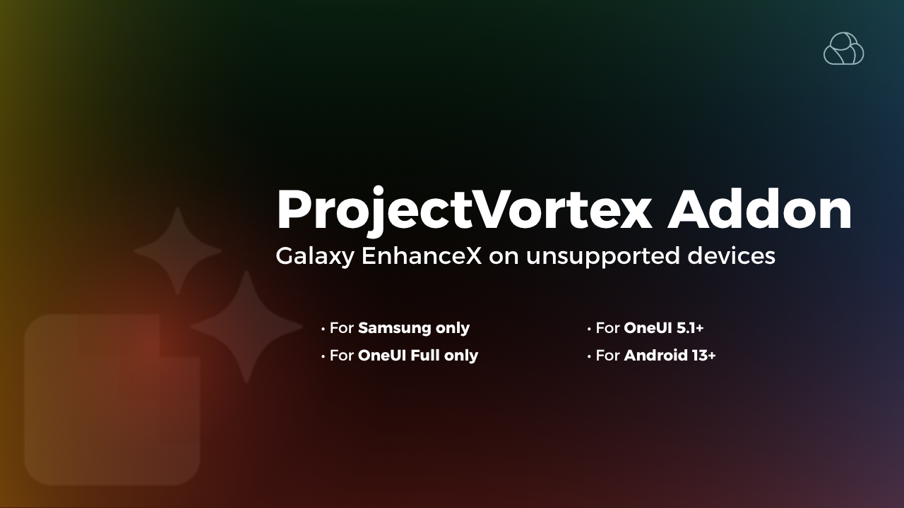

# ProjectVortex Addon

  

 
  
**Galaxy EnhanceX on unsupported devices**
  

---

## What is ProjectVortex Addon ?
ProjectVortex Addon is a module for LSPosed that make Galaxy Enhance X working with unsupported samsung devices by spoofing device as S22

## How to install
### Prerequisites
To use this module you must have one of the following (latest versions):
- [Magisk](https://github.com/topjohnwu/Magisk) with Zygisk enabled
    - IMPORTANT: DO NOT add apps that you want to spoof to Magisk's denyList as that will break the module.
- [KernelSU](https://github.com/tiann/KernelSU) with [ZygiskNext](https://github.com/Dr-TSNG/ZygiskNext) module installed
- [APatch](https://github.com/bmax121/APatch) with [ZygiskNext MOD](https://github.com/Yervant7/ZygiskNext) module installed
You must also have [LSPosed](https://github.com/mywalkb/LSPosed_mod) installed

### Installation
- Download the latest APK of ProjectVortex Addon from the [releases section](https://github.com/mrx7014/ProjectVortex-Addon/releases) and install it like any normal APK.
- Now open the LSPosed Manager and go to "Modules".
- ProjectVortexAddon should now appear in that list.
- Click on ProjectVortexAddon and enable the module by flipping the switch at the top that says "Enable module".
- Next, Choose Galaxy EnhanceX app and reboot device (optional if not working).
- Once rebooted, you should be able to successfully open Galaxy EnhanceX.

[MRX7014 Cloud Telegram](https://t.me/mrx7014cloud)
